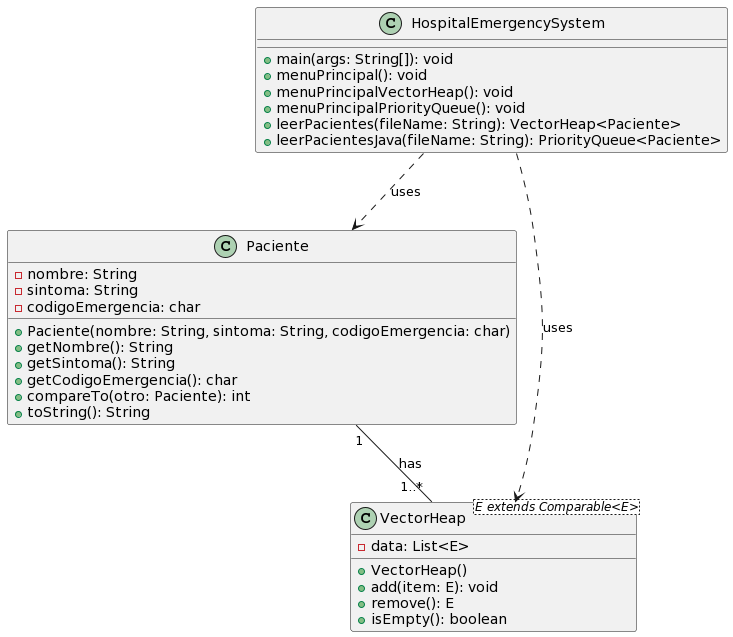

# Hospital Emergency System

---

## Autores
- [Diego Fernando Patzán Marroquín (23525)](https://github.com/dpatzan2)


---

## Descripción
El Hospital Emergency System es un sistema de atención de emergencias diseñado para gestionar la llegada y atención de pacientes en una sala de emergencias de un hospital. El sistema utiliza una cola con prioridad para determinar el orden de atención de los pacientes según la gravedad de su condición médica.

---

## UML (Diagrama de Clases)




---

## Pasos de Instalación
1. Clona el repositorio desde GitHub:
   ```bash
   git clone https://github.com/dpatzan2/Hoja-de-trabajo-8.git
   ```